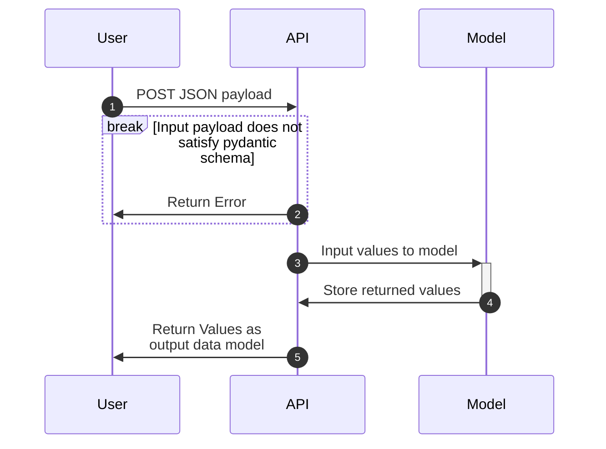

# README

## Application

This application is an API that allows a user to input the following house features to a /predict endpoint, which will output a house price prediction:


        ```{json}
        {
            Median Income: PositiveFloat
            Age of the House: PositiveFloat
            Average Number of Rooms: PositiveFloat
            Average Number of Bedrooms: PositiveFloat
            Population: PositiveFloat
            Average Occupancy: PositiveFloat
            Latitude: confloat(le=43, ge=32.5)
            Longitude: confloat(le=-114, ge=-125)        
         }
        ```


Please note that the API /predict endpoint will only handle houses in the state of California, and will return an error for all other lat/long ranges. Additionally, errors will be returned for Median Income, Age of the House, Number of Rooms, Bedrooms, Population, and Occupancy if the inputs are not positive floats. 
For more information on this dataset, please refer to sklearn's documentation on the California housing dataset [here](https://scikit-learn.org/stable/modules/generated/sklearn.datasets.fetch_california_housing.html).

This API also allows users to pass their names to a /hello endpoint, which will return 

    ```{json}
    {
      "message": "hello [name]"
    }
    ```

This API leverages FastAPI, which also allows the client to access OpenAPI documentation at the _/docs_ endpoint, and a json object that meets the OpenAPI v3 specifications at the _/openapi.json_ endpoint. 

The application is containerized using Docker, which is built using a multistage framework. This application can be tested locally using poetry and a pytest framework, or upon deployment using a bash script. 

## How to build the application

This application leverages python 3.11, Pydantic, FastAPI, and Uvicorn, all managed through poetry, which is a dependencies manager. The development and production dependencies can be viewed in the pyproject.toml file. The file tree is as follows: 

```text
.
├── lab2
│   ├── Dockerfile
│   ├── README.md
│   ├── model_pipeline.pkl
│   ├── poetry.lock
│   ├── pyproject.toml
│   ├── src
│   │   ├── __init__.py
│   │   └── main.py
│   ├── tests
│   │   ├── __init__.py
│   │   └── test_lab2.py
│   └── trainer
│       ├── predict.py
│       └── train.py
└── run.sh
```

_src_ contains the application, which is a locally hosted API that allows a user to curl or make a request to the /predict endpoint, or receive a personalized greeting message. This app is created with FastAPI, which conveniently creates endpoints for API documentation and an OpenAPI json example. _tests_ contains the pytest framework for testing these endpoints during the development stage. The Dockerfile contains a multistage build that runs the API on a Docker image. The _run.sh_ script tests the endpoints upon deployment as a final unit test. 

To build this, run the following script:

```bash
docker build -t lab2:latest .
```

## How to run the application

This application can be run locally or through Docker. If running locally, in a terminal, run the following command within the _src_ folder: 

```bash
poetry run uvicorn main:app --reload
```

This will open a port on your local machine, which will allow you to access the API endpoints. Copy the url that is provided to you and paste it into your browser to access the endpoint to access the browser based application at the /hello endpoint. Type _/hello?name={Insert Your Name}_ to access that application. You must input an alphanumeric string. No name query or an empty name query parameter will result in a 422 error. You may access the API docs at the _/docs_ directory and an OpenAPI json object at _/openapi.json_

Examples of valid queries to the /hello endpoint include:

```bash
http://localhost:8000/hello?name=Landon

http://localhost:8000/hello?name=*L1don

http://localhost:8000/docs

http://localhost:8000/openapi.json
```

The following queries will return exceptions:

```bash
http://localhost:8000/hello?name=

http://localhost:8000/hello

http://localhost:8000/
```

One can also run this API through Docker by building a docker container and image. To do this, you may execute the following commands within the lab_2 directory.

```bash
./run.sh
```

This will run the API through Docker, but will also shut down the container and image. If you need to access the API for longer, I suggest removing the docker remove statements from the run.sh file. 

The /predict endpoint will take specific datatypes (listed in the Application section of this file). Any deviation from these types, additional features, or fewer inputted features will result in 422 errors and an unsuccessful attempt to predict.

One can make a successful POST to the /predict endpoint by writing the following script in bash: 


```bash
curl -X POST -H "Content-Type: application/json" -d '{
    "MedInc": 8.3252,
    "HouseAge": 41.0,
    "AveRooms": 6.98412698,
    "AveBedrms": 1.02380952,
    "Population": 322.0,
    "AveOccup": 2.55555556,
    "Lat": 37.88,
    "Long": -122.23
}' http://127.0.0.1:8000/predict
```

## Testing the API 

Lastly, you may test the endpoints by running in the lab_2 directory:

```bash
poetry run pytest
```

Or by running the _run.sh_ script in the lab_2 directory. 

```bash
./run.sh
```

## Answers to Questions

-[]  What does Pydantic handle?

   -[] Pydantic handles data validation and parsing for seamless integration of user input into the model pipeline. It allows us to have models that have specific input constraints, and will raise verbose error messages to the user so that the user can understand what to change. It can parse inputs from different data types, including 
   JSON, which is obviously important for an API model. 

-[] What does Github Actions do?

   -[] Github actions exists to facilitate CI/CD processes. By allowing for the uploaded codebase to be run without having to download and install all packages; the code development, review, and deployment process becomes seamless as the reviewers are not required to set up their own development environment. This allows for an easier code review by the person who is auditing the pull request. This facilitates collaboration among developers, and reduces bottlenecks and errors in the development and deployment process. 

-[] Explain the sequence diagram

   -[] The sequence diagram below shows a user interacting with an application through an API via a JSON input. If the input is does not match the pydantic schema, the user receives an error, but if the input is correct, then the user is able to successfully access the model application through the endpoint. A successful POST will allow the model to store the model output in cache, and the user will receive response with the model output. 
   


